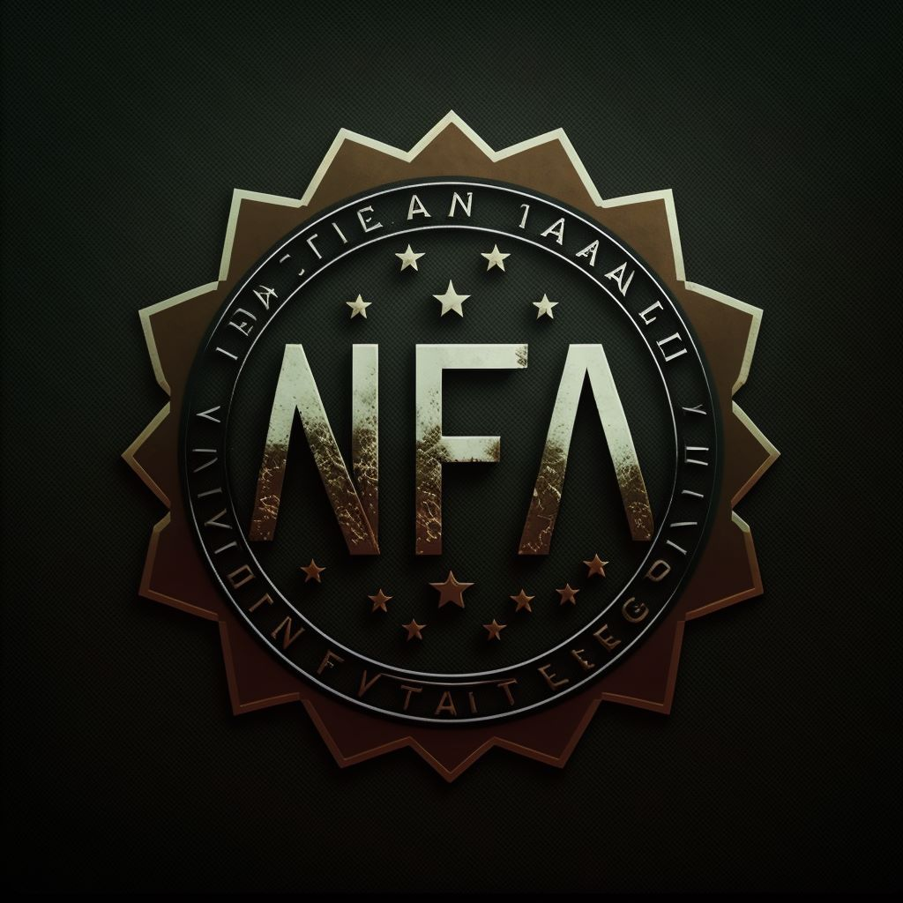

<!-- Improved compatibility of back to top link: See: https://github.com/othneildrew/Best-README-Template/pull/73 -->

<a name="readme-top"></a>

<!--
*** Thanks for checking out the Best-README-Template. If you have a suggestion
*** that would make this better, please fork the repo and create a pull request
*** or simply open an issue with the tag "enhancement".
*** Don't forget to give the project a star!
*** Thanks again! Now go create something AMAZING! :D
-->

<!-- PROJECT SHIELDS -->
<!--
*** I'm using markdown "reference style" links for readability.
*** Reference links are enclosed in brackets [ ] instead of parentheses ( ).
*** See the bottom of this document for the declaration of the reference variables
*** for contributors-url, forks-url, etc. This is an optional, concise syntax you may use.
*** https://www.markdownguide.org/basic-syntax/#reference-style-links
-->

<!-- PROJECT LOGO -->
<br />
<div align="center">
  <a href="https://github.com/lordshashank/NFTs-for-All">
    
  </a>

<h3 align="center">NFA</h3>

  <p align="center">
    Manifold your NFTs market with one stop NFT marketplace NFA - NFTs for ALL
    <br />
    <a href="https://devfolio.co/projects/nfa-nfts-for-all-34e5"><strong>Explore the docs »</strong></a>
    <br />
    <br />
    <a href="https://youtu.be/eZpGk-gldYc">View Demo</a>
    ·
    <a href="https://github.com/lordshashank/NFTs-for-All/issues">Report Bug</a>
    ·
    <a href="https://github.com/lordshashank/NFTs-for-All/issues">Request Feature</a>
  </p>
</div>

<!-- TABLE OF CONTENTS -->
<details>
  <summary>Table of Contents</summary>
  <ol>
    <li>
      <a href="#about-the-project">About The Project</a>
      <ul>
        <li><a href="#built-with">Built With</a></li>
      </ul>
    </li>
    <li>
      <a href="#getting-started">Getting Started</a>
      <ul>
        <li><a href="#prerequisites">Prerequisites</a></li>
        <li><a href="#installation">Installation</a></li>
      </ul>
    </li>
    <li><a href="#usage">Usage</a></li>
    <li><a href="#roadmap">Roadmap</a></li>
    <li><a href="#contributing">Contributing</a></li>
    <li><a href="#license">License</a></li>
    <li><a href="#contact">Contact</a></li>
    <li><a href="#acknowledgments">Acknowledgments</a></li>
  </ol>
</details>

<!-- ABOUT THE PROJECT -->

## About The Project

[![Product Name Screen Shot][product-screenshot]](https://example.com)

NFA is one stop NFT solution for users, where users get various options like fractional NFTs, subscription based NFTs, and of course the regular NFTs. Currently, user has to use different marketplaces to interact with these different types of NFTs which is quite hectic and tough to handle. Through our marketplace, users can handle all of them easily at one site.

NFTs are an important aspect of the Ethereum foundation. Our project NFA aims to increase the utilities of NFTs by opening various ways to interact with them at one place. Currently, there are many marketplaces like opensea which work on general NFTs, fractional.art which work specifically on fractional NFTs, etc. Our marketplace aims to provide these and many more features at one place with very easy transition between them.

<p align="right">(<a href="#readme-top">back to top</a>)</p>

### Built With

- [![Next][next.js]][next-url]
- [![React][react.js]][react-url]
- [https://hardhat.org/]
- [https://ethereum.org/en/]
- [https://nodejs.org/en/]
- [https://alchemyapi.io/]

<p align="right">(<a href="#readme-top">back to top</a>)</p>

<!-- GETTING STARTED -->

## Getting Started

We would be deploying our Dapp publicly soon.
Developers could test our smart contracts by cloning our contracts folder and following the steps below.

### Prerequisites

You should have npm/yarn installed in your system.

- npm
  ```sh
  npm install npm@latest -g
  ```

### Installation

1. open your terminal.
2. Clone the repo
   ```sh
   git clone https://github.com/lordshashank/NFTs-for-All.git
   cd contracts
   ```
3. Install NPM packages
   ```sh
   npm install
   ```
4. Test the the contracts using hardhat
   ```sh
   npx hardhat test
   ```

<p align="right">(<a href="#readme-top">back to top</a>)</p>

<!-- USAGE EXAMPLES -->

## Usage

Our marketplace tends to solve the problems that users face while interacting with NFTs with current available marketplaces. some examples are:
Let's say a person creates an NFT and puts it on sale but it doesn't do well in market, he can fractionalize it with just one click and handle the fractions easily at NFA. Fractionalizing will increase market as well as reduce price for his NFTs increasing chances of his NFTs being sold.
Similarly, user getting buyers for all his NFTs may want to put it on subscription so as to earn more from it. He can do that easily with just one click at NFA.
These are just some use cases, there are many other ways one can use our marketplace for their profit.

<p align="right">(<a href="#readme-top">back to top</a>)</p>

<!-- ROADMAP

## Roadmap

- [ ] Feature 1
- [ ] Feature 2
- [ ] Feature 3
  - [ ] Nested Feature

See the [open issues](https://github.com/lordshashank/NFTs-for-All/issues) for a full list of proposed features (and known issues).

<p align="right">(<a href="#readme-top">back to top</a>)</p> -->

<!-- CONTRIBUTING -->

## Contributing

Contributions are what make the open source community such an amazing place to learn, inspire, and create. Any contributions you make are **greatly appreciated**.

If you have a suggestion that would make this better, please fork the repo and create a pull request. You can also simply open an issue with the tag "enhancement".
Don't forget to give the project a star! Thanks again!

1. Fork the Project
2. Create your Feature Branch (`git checkout -b feature/AmazingFeature`)
3. Commit your Changes (`git commit -m 'Add some AmazingFeature'`)
4. Push to the Branch (`git push origin feature/AmazingFeature`)
5. Open a Pull Request

<p align="right">(<a href="#readme-top">back to top</a>)</p>

<!-- LICENSE -->

<!-- ## License

Distributed under the MIT License. See `LICENSE.txt` for more information.

<p align="right">(<a href="#readme-top">back to top</a>)</p> -->

<!-- CONTACT -->

## Contact

Your Name - [@0xlord_forever](https://twitter.com/0xlord_forever) - shashanktrivedi1917@gmail.com

Project Link: [https://devfolio.co/projects/nfa-nfts-for-all-34e5](https://devfolio.co/projects/nfa-nfts-for-all-34e5)

<p align="right">(<a href="#readme-top">back to top</a>)</p>

<!-- ACKNOWLEDGMENTS -->

<!-- ## Acknowledgments

- []()
- []()
- []()

<p align="right">(<a href="#readme-top">back to top</a>)</p> -->

<!-- MARKDOWN LINKS & IMAGES -->
<!-- https://www.markdownguide.org/basic-syntax/#reference-style-links -->

[contributors-shield]: https://img.shields.io/github/contributors/github_username/repo_name.svg?style=for-the-badge
[contributors-url]: https://github.com/lordshashank/NFTs-for-All/graphs/contributors
[forks-shield]: https://img.shields.io/github/forks/github_username/repo_name.svg?style=for-the-badge
[forks-url]: https://github.com/lordshashank/NFTs-for-All/network/members
[stars-shield]: https://img.shields.io/github/stars/github_username/repo_name.svg?style=for-the-badge
[stars-url]: https://github.com/lordshashank/NFTs-for-All/stargazers
[issues-shield]: https://img.shields.io/github/issues/github_username/repo_name.svg?style=for-the-badge
[issues-url]: https://github.com/lordshashank/NFTs-for-All/issues
[license-shield]: https://img.shields.io/github/license/github_username/repo_name.svg?style=for-the-badge
[license-url]: https://github.com/lordshashank/NFTs-for-All/blob/master/LICENSE.txt
[linkedin-shield]: https://img.shields.io/badge/-LinkedIn-black.svg?style=for-the-badge&logo=linkedin&colorB=555
[linkedin-url]: https://linkedin.com/in/linkedin_username
[product-screenshot]: ./frontend/public/NFAlanding.png
[next.js]: https://img.shields.io/badge/next.js-000000?style=for-the-badge&logo=nextdotjs&logoColor=white
[next-url]: https://nextjs.org/
[react.js]: https://img.shields.io/badge/React-20232A?style=for-the-badge&logo=react&logoColor=61DAFB
[react-url]: https://reactjs.org/
[vue.js]: https://img.shields.io/badge/Vue.js-35495E?style=for-the-badge&logo=vuedotjs&logoColor=4FC08D
[vue-url]: https://vuejs.org/
[angular.io]: https://img.shields.io/badge/Angular-DD0031?style=for-the-badge&logo=angular&logoColor=white
[angular-url]: https://angular.io/
[svelte.dev]: https://img.shields.io/badge/Svelte-4A4A55?style=for-the-badge&logo=svelte&logoColor=FF3E00
[svelte-url]: https://svelte.dev/
[laravel.com]: https://img.shields.io/badge/Laravel-FF2D20?style=for-the-badge&logo=laravel&logoColor=white
[laravel-url]: https://laravel.com
[bootstrap.com]: https://img.shields.io/badge/Bootstrap-563D7C?style=for-the-badge&logo=bootstrap&logoColor=white
[bootstrap-url]: https://getbootstrap.com
[jquery.com]: https://img.shields.io/badge/jQuery-0769AD?style=for-the-badge&logo=jquery&logoColor=white
[jquery-url]: https://jquery.com
